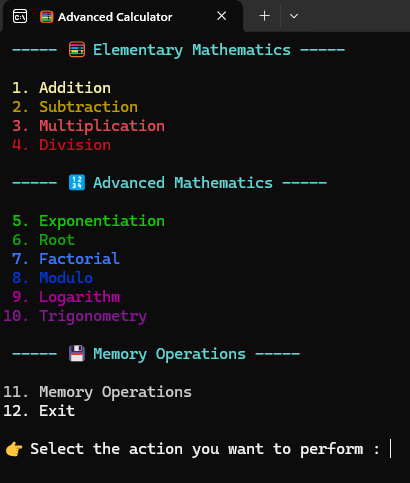
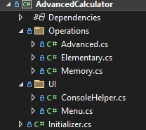

# 🧮 Advanced Calculator
A comprehensive console-based scientific calculator application. Developed in C# using the .NET 8.0 SDK, it stands out with its user-friendly interface, emoji support, and robust error handling.

## ✨ Features

### 🔢 Basic Mathematical Operations
- ➕ **Addition** - Calculates the sum of two numbers
- ➖ **Subtraction** - Calculates the difference between two numbers
- ✖️ **Multiplication** - Calculates the product of two numbers
- ➗ **Division** - Calculates the quotient of two numbers (with zero division check)

### 🔬 Advanced Mathematical Operations
- **xⁿ Exponentiation** - Calculates the power of a number
- **ⁿ√x Root Extraction** - Calculates the root of a number
- **❗ Factorial** - Calculates the factorial of a number (0-20 range)
- **% Modulo** - Calculates the remainder of two numbers
- **logx(y) Logarithm** - Calculates logarithm with specified base

### 📐 Trigonometric Functions
- **Sin** - Sine function
- **Cos** - Cosine function
- **Tan** - Tangent function
- **Cot** - Cotangent function
- **Sec** - Secant function
- **Csc** - Cosecant function

### 🧠 Memory Operations
- **Add to Memory** - Adds a number to the current memory value
- **Subtract from Memory** - Subtracts a number from the current memory value
- **Clear Memory** - Resets the memory value to zero
- **Recall Memory** - Shows the current memory value

### 🎨 User Experience
- 🌈 **Colored Console Outputs** - Different colors for errors, successes, and info messages
- 🎭 **Emoji Support** - Visually rich interface
- ⏳ **Transition Animations** - Smooth experience between operations
- 🇬🇧 **English Interface** - Full English language support

### 🛡️ Security and Error Handling
- ✅ **Comprehensive Validation** - Input validation for all operations
- ⚠️ **Mathematical Checks** - Warnings for undefined operations
- 🔄 **Null Control** - Protection against empty inputs
- 📊 **Overflow Protection** - Security for large numbers

## 🚀 Installation

### Requirements
- [.NET 8.0 SDK](https://dotnet.microsoft.com/download/dotnet/8.0) or higher
- Windows, macOS, or Linux

### Step-by-Step Installation
1. **Clone the Project**
```bash
git clone https://github.com/Kaaner4mir/console-lab.git
cd console-lab/AdvancedCalculator
```
2. **Install Dependencies**
```bash
dotnet restore
```
3. **Build the Project**
```bash
dotnet build
```
4. **Run the Application**
```bash
dotnet run
```

## 📖 Usage



### Usage Examples

#### Basic Operations
Selection: 1 (Addition)  
First number: 15.5  
Second number: 7.3  
Result: ✅ Operation result: 22.8

#### Trigonometric Operations
Selection: 10 (Trigonometry)  
Sub-menu selection: 1 (Sin)  
Degree: 30  
Result: ✅ Sin(30°) = 0.5

#### Memory Operations
Selection: 11 (Memory Operations)  
Sub-menu selection: 1 (Add to Memory)  
Number: 100  
Result: 💡 Memory : 100

## 🏗️ Project Structure



## 🔧 Technical Details

### Technologies Used
- **.NET 8.0** - Framework
- **C#** - Programming language
- **Console Application** - Application type

### Architectural Features
- **Static Methods** - All methods are static
- **Functional Programming** - Delegate usage
- **Exception Handling** - Comprehensive error management
- **Input Validation** - Input verification

### Performance Features
- **Memory Efficient** - Low memory usage
- **Fast Execution** - Quick processing time
- **Responsive UI** - Responsive user interface

## 🧪 Test Scenarios

### Valid Tests
- ✅ Basic mathematical operations
- ✅ Trigonometric functions
- ✅ Memory operations
- ✅ Error conditions

### Sample Test Data
Addition: 5 + 3 = 8  
Multiplication: 4 × 7 = 28  
Exponentiation: 2^3 = 8  
Root: √16 = 4  
Sin(30°): 0.5  
Factorial(5): 120

## 🤝 Contributing
1. Fork this repository  
2. Create a feature branch (git checkout -b feature/AmazingFeature)  
3. Commit your changes (git commit -m 'Add some AmazingFeature')  
4. Push to the branch (git push origin feature/AmazingFeature)  
5. Open a Pull Request

## 👨‍💻 Developer
**Kaaner4mir** - [GitHub Profile](https://github.com/Kaaner4mir)

## 🙏 Acknowledgments
- [.NET Documentation](https://docs.microsoft.com/en-us/dotnet/)  
- [C# Programming Guide](https://docs.microsoft.com/en-us/dotnet/csharp/)  
- [Console Application Tutorial](https://docs.microsoft.com/en-us/dotnet/core/tutorials/console-apps)
