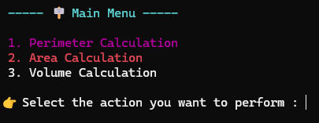
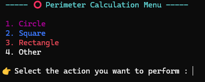
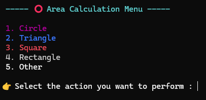
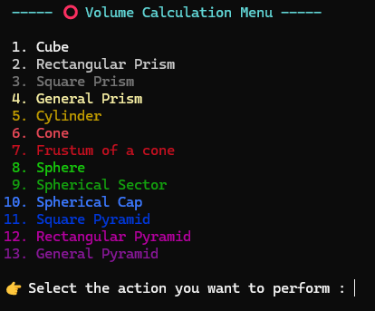
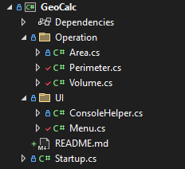

# 🧮 Geometric Calculator
A comprehensive console-based geometric calculator application developed in C# using .NET 8.0 SDK. It performs area, perimeter, and volume calculations for 2D and 3D shapes with a user-friendly interface, emoji support, and robust error handling.

### ✨ Features

## 📐 Geometric Calculations

- Area Calculations: Circle, Square, Rectangle, Triangle, Polygon (Pentagon, Hexagon)

- Perimeter Calculations: Same shapes as above

- Volume Calculations: Cube, Rectangular Prism, Sphere, Cylinder

## 🎨 User Experience

- 🌈 Colored console outputs for better readability

- 🎭 Emoji support for a visually rich interface

- ⏳ Smooth menu transitions

- 🇬🇧 English interface

## 🚀 Installation

### Requirements
- [.NET 8.0 SDK](https://dotnet.microsoft.com/download/dotnet/8.0) or higher
- Windows, macOS, or Linux

### Step-by-Step Installation
1. **Clone the Project**
```bash
git clone https://github.com/Kaaner4mir/console-lab.git
cd console-lab/GeoCalc
```
2. **Install Dependencies**
```bash
dotnet restore
```
3. **Build the Project**
```bash
dotnet build
```
4. **Run the Application**
```bash
dotnet run
```

## 📖 Usage



### Usage Examples

#### Area Calculation Example

- Selection: 1 – Area Calculation
- Shape: Circle
- Radius: 5
- Result: ✅ Area = 78.54

#### Perimeter Calculation Example

- Selection: 2 – Perimeter Calculation
- Shape: Rectangle
- Width: 4, Height: 6
- Result: ✅ Perimeter = 20

#### Volume Calculation Example

- Selection: 3 – Volume Calculation
- Shape: Cylinder
- Radius: 3, Height: 10
- Result: ✅ Volume = 282.74

## Other Menus






## 🏗️ Project Structure

             

## 🤝 Contributing
1. Fork this repository  
2. Create a feature branch (git checkout -b feature/AmazingFeature)  
3. Commit your changes (git commit -m 'Add some AmazingFeature')  
4. Push to the branch (git push origin feature/AmazingFeature)  
5. Open a Pull Request

## 👨‍💻 Developer
**Kaaner4mir** - [GitHub Profile](https://github.com/Kaaner4mir)

## 🙏 Acknowledgments
- [.NET Documentation](https://docs.microsoft.com/en-us/dotnet/)  
- [C# Programming Guide](https://docs.microsoft.com/en-us/dotnet/csharp/)  
- [Console Application Tutorial](https://docs.microsoft.com/en-us/dotnet/core/tutorials/console-apps)
