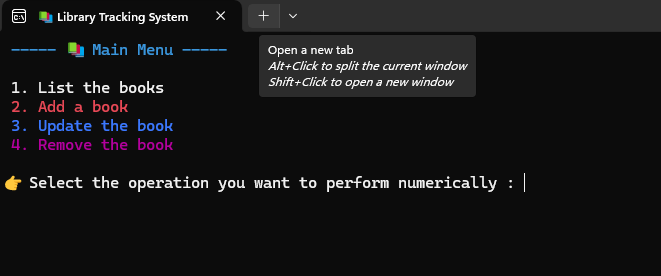

# 📚 Library Tracking System  

A comprehensive **console-based library management application** developed in **C#** using **.NET 8.0 SDK**. It allows users to manage books, update records, and track operations with a user-friendly interface, emoji support, and robust error handling.  

---

## ✨ Features  

### 🎬 Operations  

- 📖 **List Books** – Display all books in the library  
- ➕ **Add Book** – Insert a new book into the system  
- ✏️ **Update Book** – Modify details of an existing book  
- ❌ **Remove Book** – Delete a book from the system  

### 🎨 User Experience  

- 🌈 Colored console outputs for better readability  
- 🎭 Emoji support for a visually rich interface  
- ⏳ Smooth menu transitions  
- 🇬🇧 English interface  

---

## 🚀 Installation  

### Requirements  
- [.NET 8.0 SDK](https://dotnet.microsoft.com/download/dotnet/8.0) or higher  
- Windows, macOS, or Linux  

### Step-by-Step Installation  
1. **Clone the Project**  
```bash
git clone https://github.com/Kaaner4mir/console-lab.git
cd console-lab/LibraryTrackingSystem
```

2. **Install Dependencies**  
```bash
dotnet restore
```

3. **Build the Project**  
```bash
dotnet build
```

4. **Run the Application**  
```bash
dotnet run
```

---

## 📖 Usage  

  

### Usage Examples  

#### 📖 List Books Example  

- Selection: 1 – List Books  
- Result:  
✅ BookId: 1001 | Title: *The Great Gatsby* | Author: F. Scott Fitzgerald  

#### ➕ Add Book Example  

- Selection: 2 – Add Book  
- Input:  
  - Title: *1984*  
  - Author: George Orwell  
  - Genre: Dystopian  
  - Year: 1949  
- Result: ✅ Book successfully added  

#### ✏️ Update Book Example  

- Selection: 3 – Update Book  
- BookId: 1001  
- New Title: *The Great Gatsby (Updated)*  
- Result: ✅ Book details updated  

#### ❌ Remove Book Example  

- Selection: 4 – Remove Book  
- BookId: 1001  
- Result: ✅ Book successfully removed  

---

## 🏗️ Project Structure  

  

---

## 🤝 Contributing  
1. Fork this repository  
2. Create a feature branch (`git checkout -b feature/AmazingFeature`)  
3. Commit your changes (`git commit -m 'Add some AmazingFeature'`)  
4. Push to the branch (`git push origin feature/AmazingFeature`)  
5. Open a Pull Request  

---

## 👨‍💻 Developer  
**Kaaner4mir** – [GitHub Profile](https://github.com/Kaaner4mir)  

---

## 🙏 Acknowledgments  
- [.NET Documentation](https://docs.microsoft.com/en-us/dotnet/)  
- [C# Programming Guide](https://docs.microsoft.com/en-us/dotnet/csharp/)  
- [Console Application Tutorial](https://docs.microsoft.com/en-us/dotnet/core/tutorials/console-apps)  
